# book-key-takeaways

### Entrepeneurship 

| Cover         | Title         | Link  |
| ------------- |:-------------:| -----:|
|  | The Mom test | [key takeaways](the_mom_test/takeaways.md) |
| 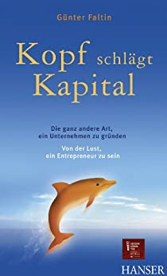 | Kopf schlägt Kapital: Die ganz andere Art, ein Unternehmen zu gründen - Von der Lust, ein Entrepreneur zu sein  | [key takeaways](kopf_schlaegt_kapital/takeaways.md)|
|  | Developer Hegemony: The Future of Labor (English Edition) | [key takeaways](developer_hegemony/takeaways.md) |
| 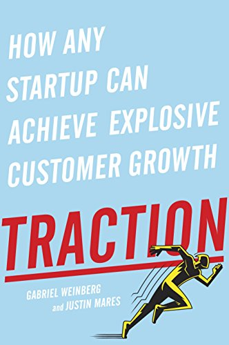 | Traction | [key takeaways](traction/takeaways.md) |
| 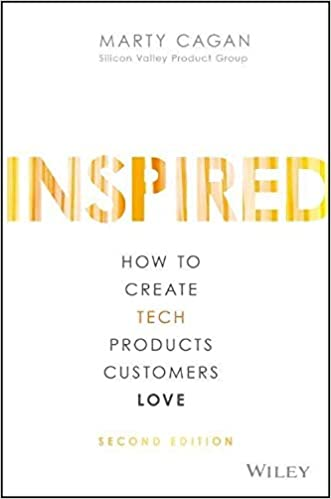 | Inspired: How to Create Tech Products Customers Love | [key takeaways](inspired/takeaways.md) |
| 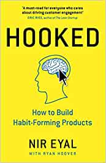 | Hooked: How to Build Habit-Forming Products | [key takeaways](hooked/takeaways.md) |
|  | Zero to Sold: How to Start, Run, and Sell a Bootstrapped Business | [key takeaways](zero_to_sold/takeaways.md) |

### Marketing 

| Cover         | Title         | Link  |
| ------------- |:-------------:| -----:|
|  | Trust Me, I'm Lying: Confessions of a Media Manipulator  | [key takeaways](trust_me_im_lying/takeaways.md) |

### Game Section

| Cover         | Title         | Link  |
| ------------- |:-------------:| -----:|
| 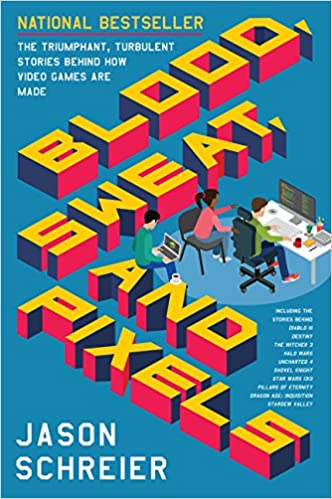 | Blood, Sweat, and Pixels: The Triumphant, Turbulent Stories Behind How Video Games Are Made | [key takeaways](blood_sweat_and_pixels/takeaways.md) |
| 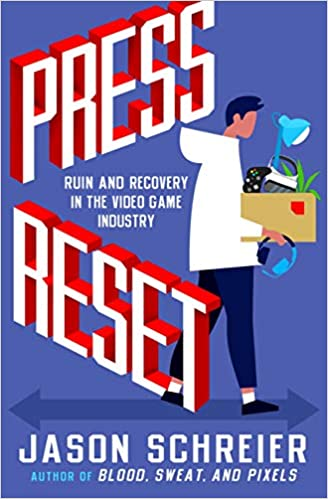 | Press Reset: Ruin and Recovery in the Video Game Industry | [key takeaways](press_reset/takeaways.md) |

### IT-Management

| Cover         | Title         | Link  |
| ------------- |:-------------:| -----:|
| 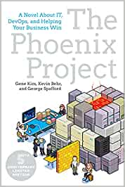 | The Phoenix Project | [key takeaways](the_phoenix_project/takeaways.md) |
| 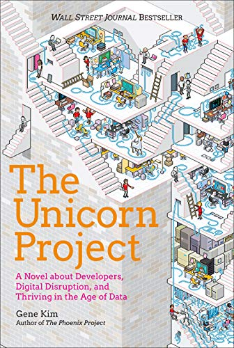 | The Unicorn Project | [key takeaways](the_unicorn_project/takeaways.md) |
| 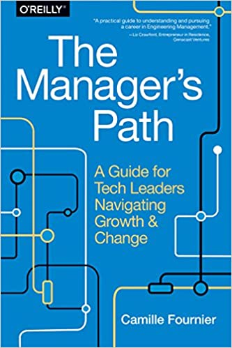 | The Manager Path | [key takeaways](the_managers_path/takeaways.md) |
| 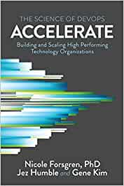 | Accelerate | [key takeaways](accelerate/takeaways.md) |
| 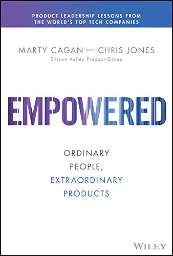 | EMPOWERED: Ordinary People, Extraordinary Products | [key takeaways](empowered/takeaways.md) |
| 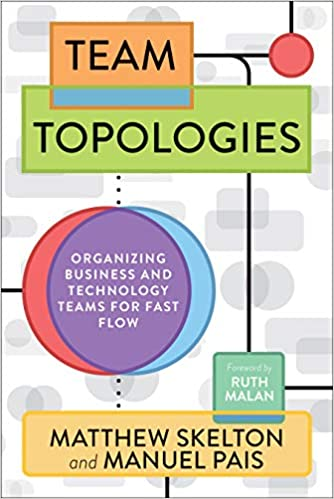 | Team Topologies: Organizing Business and Technology Teams for Fast Flow | [key takeaways](team_topologies/takeaways.md) |

### Programming / Architecture

| Cover         | Title         | Link  |
| ------------- |:-------------:| -----:|
|  | Building Evolutionary Architectures: Support Constant Change | [key takeaways](building_evolutionary_architectures/takeaways.md) |
| 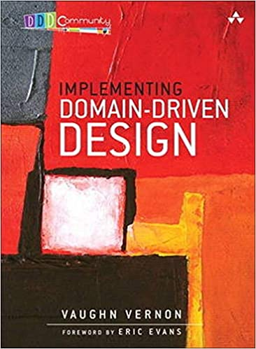 | Implementing Domain-Driven Design | [key takeaways](implementing_domain_driven_design/takeaways.md) |
| 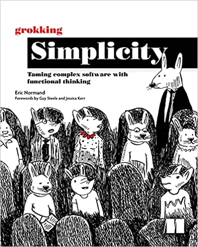 | Grokking Simplicity: Taming Complex Software With Functional Thinking | [key takeaways](grokking_simplicity/takeaways.md) |

### Psychology
| Cover         | Title         | Link  |
| ------------- |:-------------:| -----:|
|  |  Never Split the Difference: Negotiating as if Your Life Depended on It | [key takeaways](never_split_the_difference/takeaways.md) |
|  |  Think Again: The Power of Knowing What You Don't Know | [key takeaways](think_again/takeaways.md) |

|  | Brain Rules for Work | [key takeaways](brain_rules_for_work/takeaways.md) |
