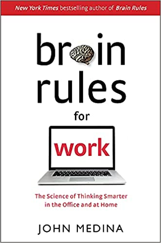

### Brain Rules for Work: The Science of Thinking Smarter in the Office and at Home

## In Präsentationen
Informationen hierarchisch aufbauen. 
Erst warum etwas wichtig ist und dann die Details.

Erst Eindruck ist wichtig.

Audienz hört ca. 10min. passiv zu.
Danach muss ein Impuls (Hook) gesetzt werden umd die Audienz abzuholen.

Ein Hook muss

#### Emotional sein
Babys, Katzen etc. triggern

#### Relevant zum Thema passen

#### Kurz sein

#### eine Story erzählen

## Arbeiten am Computer
Pause alle 90min.
Entweder draußen rumgehen oder dort wo zumindest, Pflanzen, Wasserfälle, Bäche sind.

## Lösungsfindung / Kommunikation
Verbal agressiv zu sein, hilft bei der Lösungsfindung.
Menschen gehen dann in eine Abwehrhaltung und sehen einen als "Bedrohung" an.
Dadurch fällt dann die "innovative produktivität". 

"Schreien hilft genauso viel der Kreativität, wie eine Pistole auf die Person zu halten"

#### Divergentes Denken
> Viele Ideen mit einem offenen Ende 

Benötigt stressfreie Umgebung, benötigt eher mehr Zeit 

#### Convergentes Denken
> Viele Lösungen für ein Problem

Eher kurze Zeit. Eher in stressvollen Umgebung. 

## Konflikte

20 min. Zeit nehmen um auf zu schreiben wo der Konflikt war, aber aus der neutralen 3rd Party Perspektive.

Dies einige Tage durchziehen.

[Pennecker excersise](https://www.google.com/search?q=Pennebaker+exercise)

## 

[prejudice habit-breaking intervention](https://www.google.com/search?q=prejudice+habit-breaking+intervention)
