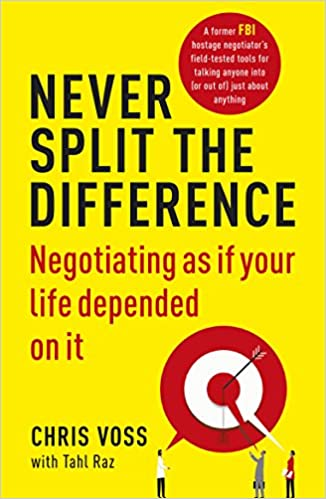

### Never Split the Difference: Negotiating as if Your Life Depended on It 

#### Komppromisse können schlecht sein
Analogie: Hast ein Anzug an und diskutierst mit deiner Frau ob du die braunen Schuhe oder die schwarzen Schuhe anziehen sollst.
Der Kompromiss: Ein brauner, ein schwarzer.

#### Aktives Zuhören
An nichts anderes denken. 100% Aufmerksamkeit.

#### Empathie
 - durch Spiegeln: Anstatt diskutieren, gesagtes wiederholen.
 - durch Label: Die Gefühle des Gegenüber beschreiben. Ah wegen xyz bist du sauer, jetzt versteh ich warum.
 - durch Paraphrase: Das Gesagte in anderen Worten wiedergeben.

#### Bring den gegenüber dazu "Nein" zu sagen
Und zwar bei einer nicht so wichtigen Sache. Warum? Damit hat er ein Gefühl von Kontrolle hat.
Ein gezwungenes Ja führt zum unwohlsein des Gegenübers.

#### Das ist richtig vs du hast Recht.
Du hast Recht -> jaja lass mich in Ruhe. 

DAs Gespräch zu "Das ist richtig" führen, in dem man Sachverhalte/Einstellungen des gegenüber erklärt.

Z.b:

Du tust alles um guten Code zu schreiben und um eine Möglich niedrige Bugquote zu haben.

Wenn dann "Das ist richtig" kommt, dann erst die Idee pitchen.

Z.b:
Dann würde ich dir gerne mal Unittests zeigen, um das zu verbessern.

#### Meide Warum-fragen nutze Was/Wie-Fragen
