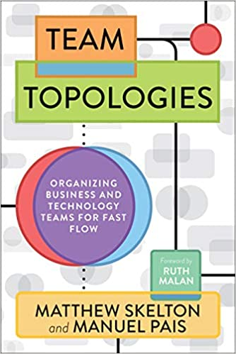

### Team Topologies: Organizing Business and Technology Teams for Fast Flow

#### Teamzusammenstellung und Kommunikation
Wenn Manager entscheiden, wie die Teams zusammengestellt werden, bestimmen die Manager die System Architektur.

Halte die notwendige Kommunikation/Abhängigkeit zwischen Teams so gering wie möglich.
Dies ist auch eine Frage der System Architektur.

Um Kommunikationen zu steuern kann man verschiedene Tools in der Organsition ausrollen.
Zb. Ein Team nutzt Slack und ein anderes Team nutzt Teams.
z.B. Chat (teams/slack)
z.B. Ticketsystem (jira instanzen, trello)
z.B. Build-system(?) 

Unterschiedliche Tools für unabhängige Teams, geteilte Tools für kollaborative Teams.

Ownership -> Keine aufgeteilten Komponenten.

#### Orga für Chats
Gruppenchats sollten einfach auffindbar sein. Z.b. über prefixe
#team-jedi
#team-...

#practice-css
#practice-js
#practice-...

Username prefixen, zb. [jedi] stefan

#### Team Grundtypen
- Stream Aligned Team (so etwas wie product/feature teams)
- Enablement Teams (teams die Stream Aligned Teams unterstützen schnell produktiv zu werden)
- Complicated Subsystem Team (teams die wirkliches spezialwissen benötigen, zb. video codec, face recognition, etc.) Fokus ist hier das wissen (cognitive load) und nicht das man geteilte Komponenten baut.
- Platform Team

#### Kritik
Das Buch referenziert häufiger das Spotify Model, aber das Spotify model wurde nie wirklich bei Spotify ausgerollt.
https://www.jeremiahlee.com/posts/failed-squad-goals/

