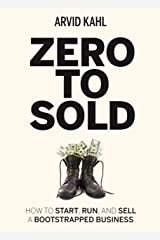

### Think Again: The Power of Knowing What You Don't Know

#### Scientific approach in startups

**Strategy**: Eine Theorie
**Kunden Interview**: Ableiten einer Hypothese
**MVP**: Validierung der Idee

##### Meinungsbildung
Frage dich: Was müsste passieren um meine Meinung zu ändern. 
Halte nach wo es eingetroffen ist und wo nicht. 

Wenn man über das *warum* redet wird es schnell persönlich und emotional. 
Ausserdem hängen wir dann mehr an der Meinung.

Es geht dann oft in die Richtung: Warum liegt der andere falsch und warum liege ich richtig". 

Wenn stattdessen über das *wie* diskutiert wird, ist die Diskussion offener und reflektierter.

##### Diskussion

Die meisten fangen die Diskussion mit dem *Strohmann* an.

Der Strohmann ist die schwächste Version des anderen Standpunkts.

Der eigene Standpunkt dagegen ist der *Stahlmann*, denn die stärkste Version des eigenen Standpunkts.

Mehr Punkte sind nicht besser als wenige wichtige. 

##### Faktenchecker
1) Hinterfragen anstatt nur zu konsumieren
2) vernachläche popularität als verlässlichkeit
3) der sender ist oft nicht quelle

##### Öfters die frage stellen: How do you know? Woher weißst du das?
