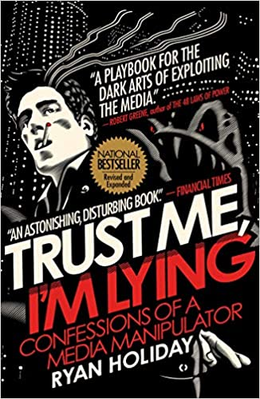

### Trust me, I'm lying

Pageview fokus daher wer Haut am schnellsten große Stories raus. Fakten werden vernachlässigt / ignoriert.
Updates produzieren neue klicks.

Medienmanipulation:
Hinweise als anonyme Tips die garnicht war sind. Produzieren von Fake Unterlagen.

Blogs funktionieren wie Boulevardpresse, Hauptsache toller Titel. 

Provokation führen zu mehr Klicks. Korrekturen bringen ebenfalls mehr klicks.

Daher besser paywall? 
Besserer Inhalt weil subscription model wie bei seriösen Tageszeitung.
